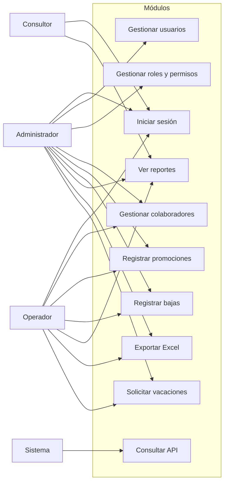
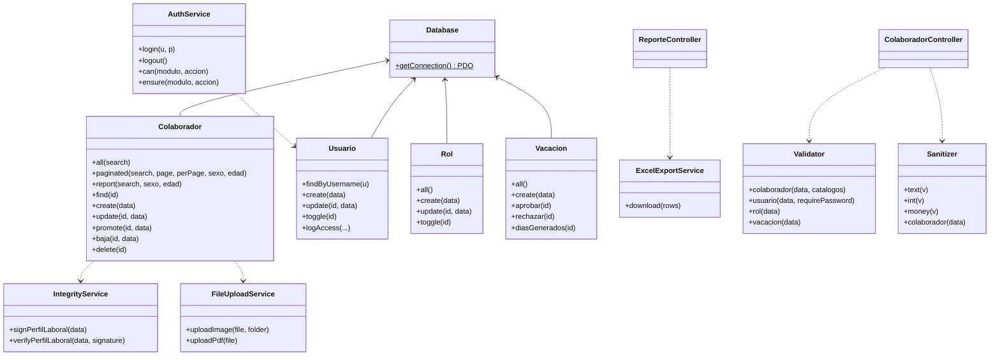
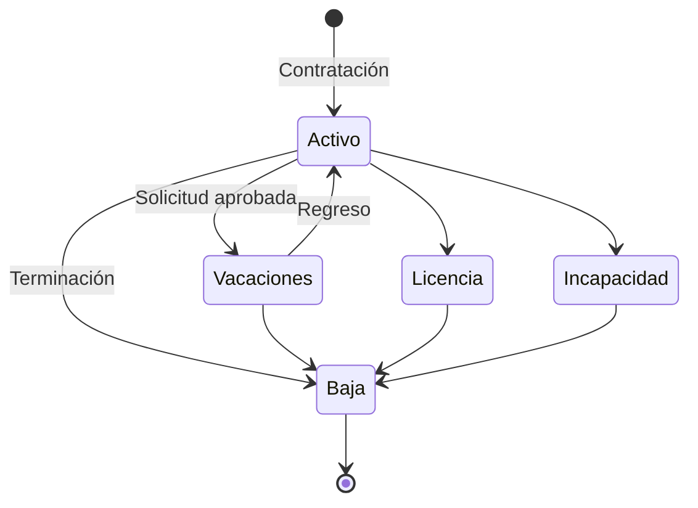
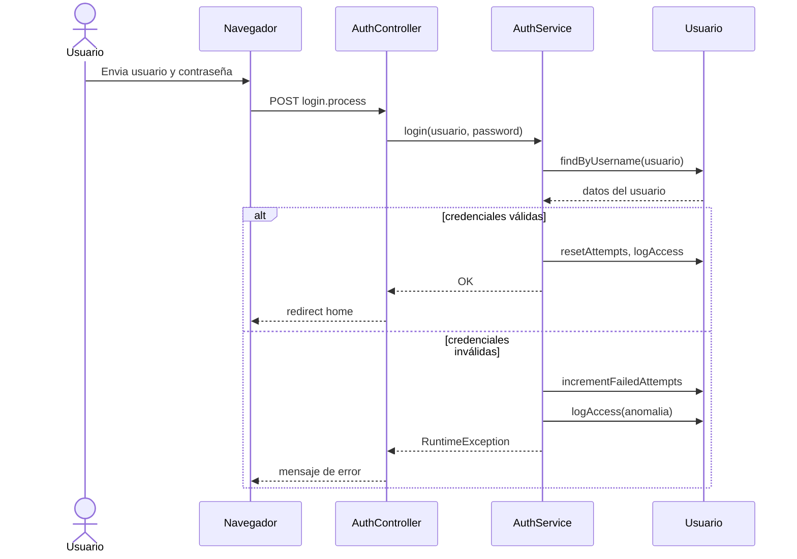
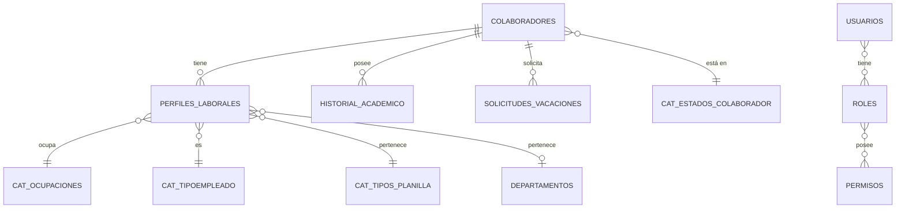

# Documentación UML — Sistema de Capital Humano

> Los diagramas están escritos en sintaxis Mermaid. Se pueden visualizar en GitHub, GitLab o con la extensión Mermaid de VS Code.

## 1. Actores

| Actor | Descripción |
|-------|-------------|
| Administrador | Acceso total: usuarios, roles, colaboradores, reportes, vacaciones. |
| Operador | Gestión diaria de colaboradores, vacaciones y reportes. |
| Consultor | Solo lectura de reportes. |
| Contraloría | Consume la API REST de colaboradores por sexo. |

## 2. Casos de uso

## 3. Diagrama de clases

## 4. Diagrama de estados — Colaborador

## 5. Diagrama de secuencia — Login

## 6. Diagrama entidad-relación (DER)

